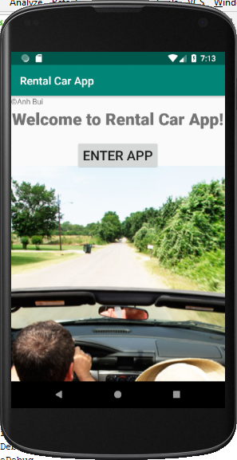
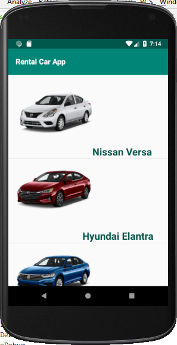
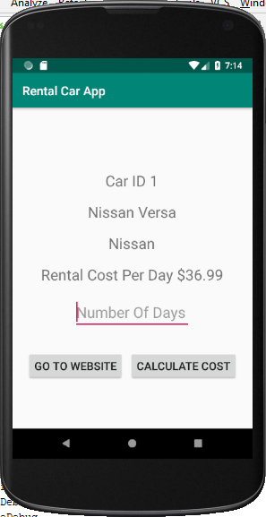
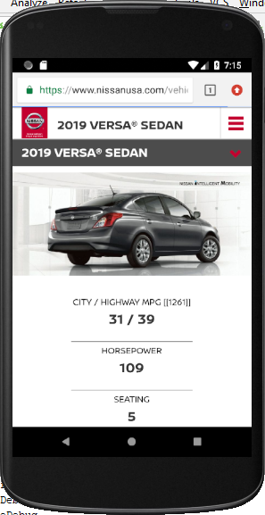
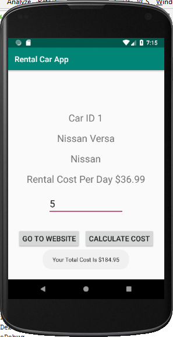

# AndroidApp-CarRentalApp
My Android App - CarRentalApp in which you can choose your rental car and calculate the rental cost by number of days.

### Purpose:	
A Rental Car app provides a listing of at least five cars. By selecting a car, users get info about the car and calculate rental costs.

### Algorithm: 	
1. An opening screen displays a welcome message (such as “Welcome to Rental Car App!”) and a button for users to go to the next screen.

2. The second screen displays a listing of cars (names).   	

3. When the user selects a car, a third screen displays the car’s Id, name, brand, rental cost per day, an input field used by customers to enter the number of rental days, and a Calculate Total Cost button.

4. On the third screen, a Car Info button can be tapped to go to the car’s web page (such as http://www.chevrolet.com/suvs/equinox-compact-suv). If the app cannot provide the link to the car’s web page, you must disable the button.

5. After the Calculate Total Cost button is “touched”, a “popup” message is displayed to show the total rental cost.  

### Conditions:	
1. Create arrays to provide the Id (integer), Name, Brand, Rental Cost per Day (decimal number), and URL of the cars. 
2. Create a Car class and use the class to make objects storing data of your rental cars. 
3. You must use a ListActivity object to display the list of cars. The arrays must be created (contained) in the ListActivity object. 
4. Each list item displays a car image and the name (such as Equinox) of each car in the list view. 
5. You make up the car data and find the car image.  

### Bonus:  
Add an image Id property in the Car class and a custom ArrayAdapter; then, you use them to display a list of 5 cars and show the different image of each car on the second screen. 

